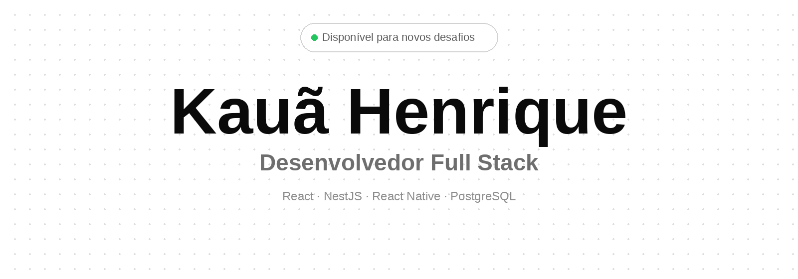
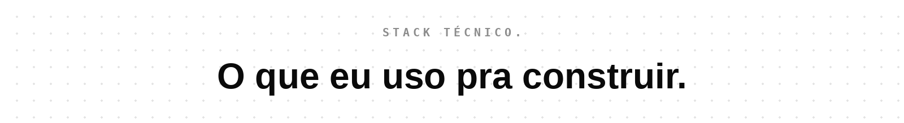

[Portfólio](https://kauahenriquedev.com.br) · [LinkedIn](https://www.linkedin.com/in/kau%C3%A3henriquedev/) · [GitHub](https://github.com/Kauasx09-Henrique) · [Email](mailto:kauahenriquesx09@gmail.com)

 

Sou Kauã Henrique, desenvolvedor de 21 anos residente em Brasília. Formado em Análise e Desenvolvimento de Sistemas, atualmente cursando bacharelado em Engenharia de Software.

Atuo no **CENSIPAM** aplicando PHP e banco de dados, integrando o desenvolvimento do **DQBRN** — painel estratégico do Exército Brasileiro para monitoramento e gestão de desastres ambientais, químicos, radiológicos e epidemiológicos.

| Atuação estratégica | Acadêmico | Tech stack base |
|---|---|---|
| CENSIPAM · DQBRN | Engenharia de Software | PHP & Banco de Dados |

 

**Atual — Estagiário em Tecnologia** `CENSIPAM`
Otimização de operações e desenvolvimento contínuo de soluções internas.

**2026 — Engenharia de Software** `BACHARELADO`
Arquiteturas escaláveis, design patterns e boas práticas de desenvolvimento moderno.

**2026 — Análise e Desenvolvimento de Sistemas** `IESB`
Metodologias ágeis e padrões de qualidade em código estruturado.

**2024 — Início da jornada acadêmica** `ADS`
Fundamentos de lógica de programação, banco de dados e arquitetura web.

**2024 — Técnico em Informática** `ETC`
Lógica algorítmica, infraestrutura de redes e administração de sistemas operacionais.

 

**React** · **React Native** · **NestJS** · **TypeScript** · **Node.js** · **JavaScript** · **Java** · **Python** · **PHP** · **C++** · **PostgreSQL** · **MySQL** · **Tailwind** · **HTML5** · **CSS3** · **Git** · **GitHub** · **Vercel** · **Render** · **Postman** · **Figma**

 

**01 · Cofre de Senhas**
`JAVA` `SPRING BOOT` `REACT` `SECURITY`
Sistema fullstack de alta segurança para gerenciamento de credenciais. Backend com Java 17, Spring Boot e Spring Security (JWT), acoplado a uma interface React minimalista.
[Código](https://lnkd.in/gx_ApngT) · [Demo](https://www.linkedin.com/feed/update/urn:li:ugcPost:7448401894865276928)

**02 · Marcador**
`REACT NATIVE` `NODE.JS` `POSTGRESQL`
App mobile fullstack para catalogação social e gamificada de livros. Escaneamento de ISBN com smart fallback e sincronização real-time no modo duo.
[Código](https://lnkd.in/dSWp6H3f) · [Demo](https://www.linkedin.com/feed/update/urn:li:ugcPost:7422745029611315200)

**03 · Bibliafy**
`REACT` `NODE.JS` `FULLSTACK`
Plataforma completa para leitura bíblica e devocionais. Sistema fullstack composto por API robusta e interface web moderna.
[Código](https://github.com/Kauasx09-Henrique/bibliafy-front-end_web) · [Demo](https://www.linkedin.com/feed/update/urn:li:ugcPost:7383655992238051328)

**04 · System Barber**
`REACT` `MANAGEMENT` `WEB`
Sistema de gestão para barbearias. Controle de agendamentos, fluxo de caixa e gestão de clientes.
[Demo](https://www.linkedin.com/feed/update/urn:li:ugcPost:7374837349064671233)

**05 · Clínica Ped**
`REACT NATIVE` `MOBILE` `HEALTH`
App mobile para gestão pediátrica. Facilita o controle de pacientes e histórico médico na palma da mão.
[Código](https://github.com/Kauasx09-Henrique/clinicaped-app-mobile) · [Demo](https://www.linkedin.com/feed/update/urn:li:ugcPost:7335650416174452736)

**06 · Disbussines**
`REACT` `DASHBOARD` `ANALYTICS`
Dashboard administrativo focado em visualização de dados e gestão empresarial inteligente.
[Código](https://github.com/Kauasx09-Henrique/Disbussines-web) · [Demo](https://www.linkedin.com/feed/update/urn:li:ugcPost:7351662946210529281)

 

 

[kauahenriquesx09@gmail.com](mailto:kauahenriquesx09@gmail.com)

